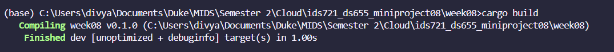
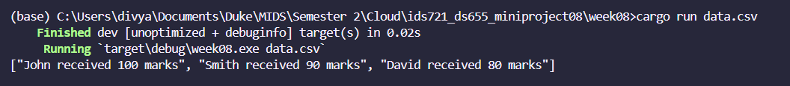
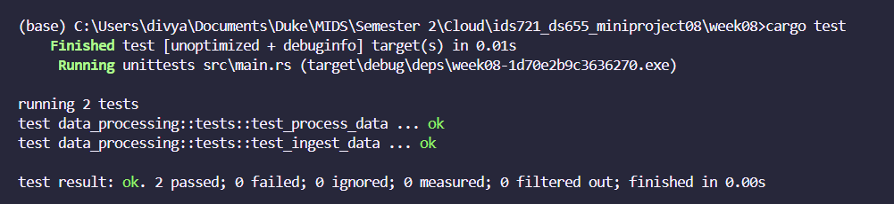

# IDS 721 DS655 Mini Project 08 - Rust Command-Line Tool with Testing

# Student Data Processing Tool

This is a command-line tool written in Rust that ingests student data from a CSV file, processes it, and outputs the results. It meets the project requirements as follows:

- **Rust command-line tool**: The tool is written in Rust and can be run from the command line.
- **Data ingestion/processing**: The tool ingests data from a CSV file and processes it to generate a report.
- **Unit tests**: The tool includes unit tests for the data ingestion and processing functions.

## Tool Functionality

The tool reads student data from a CSV file. Each line in the file represents a student with their name and marks. The tool processes this data and generates a report that includes the name of each student and their marks.

## Data Processing

The data processing part of the tool is implemented in the `ingest_data` and `process_data` functions. The `ingest_data` function reads the CSV file and converts each line into a `Student` struct. The `process_data` function takes a vector of `Student` structs and generates a report.

## Testing Implementation

The tool includes unit tests for the `ingest_data` and `process_data` functions. These tests check that the functions correctly ingest and process the data.

## Documentation

This README provides an overview of the tool and instructions on how to clone and run it.

## How to Clone and Run

To clone and run this tool, follow these steps:

1. Clone the repository:
    ```
    git clone https://gitlab.com/dukeaiml/IDS721/ids721_ds655_miniproject08
    ```

2. Navigate to the project directory:
    ```
    cd week08
    ```

3. Build the tool:
    ```
    cargo build
    ```

4. Run the tool:
    ```
    cargo run data.csv
    ```

Replace `data.csv` with the name of your CSV file.

## Sample Output

Here's a sample output of the tool:

```
John received 100 marks 
Smith received 90 marks 
David received 80 marks
```




## Testing Report

The tool includes unit tests for the `ingest_data` and `process_data` functions. These tests check that the functions correctly ingest and process the data. You can run the tests with the `cargo test` command.



